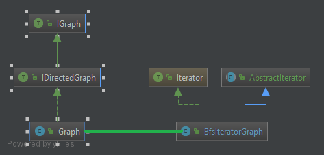

**Ogli/Fabien Etudiant 1 :**

**Kpamy/Mark Etudiant 2 :**

# Rapport TP1

## Question 1
*Retourne les arcs ayant le noeud currentNodes*
```Java
adjacence.get(currentNode) 
```
*On crée un stream*
```Java
.stream()
```
*Retourne les destinations des arcs rendus et renvoie la list*
```Java
.map(Arc::getDestination)
.collect(toList())
```

*On parcourt le HashMap adjacence en prenant chaque noeud et sa liste d'arcs*
```Java
adjacence.forEach((node, arcList) -> {
}
```

*Comme il y a une liste d'arc, on ouvre un stream dans la boucle forEach où l'on concatène chaque arc dans le format souhaité*
```Java
final String arcToString =
                    arcList.stream()
                            .map(arc -> "[" + arc.toString() + "]")
                            .collect(joining(","));
```
## Question 2
*Expliquer le code ajouté et insérer un schéma du patron de conception mis en place*
*Le patron de conception utilisé ici est le design pattern Adapteur*
Mettre une image du de la composition
*Le patron de conception utilisé ici est la composition*
```Java
    private Graph graph;
```
## Question 3
*Expliquer le code ajouté et insérer un schéma du patron de conception mis en place*



## Question 4
*Expliquer le code ajouté et insérer un schéma du patron de conception mis en place*

