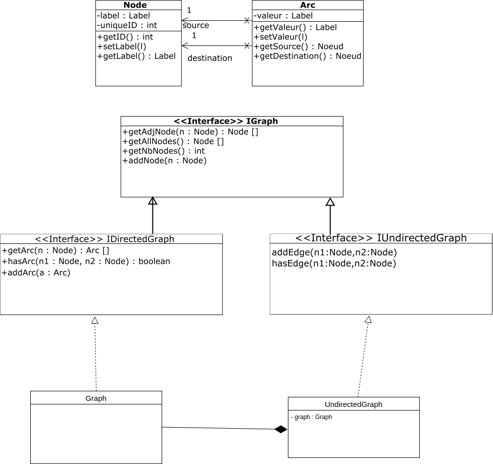

**Nom/Prénom Etudiant 1 : Ogli Fabien**

**Nom/Prénom Etudiant 2 : Kpamy Mark**

# Rapport TP1

## Question 1
*Retourne les arcs ayant le noeud currentNodes*
```Java
adjacence.get(currentNode) 
```
*On crée un stream*
```Java
.stream()
```
*Retourne les destinations des arcs rendus et renvoie la list*
```Java
.map(Arc::getDestination)
.collect(toList())
```

*On parcourt le HashMap adjacence en prenant chaque noeud et sa liste d'arcs*
```Java
adjacence.forEach((node, arcList) -> {
}
```


*Comme il y a une liste d'arc, on ouvre un stream dans la boucle forEach où l'on concatène chaque arc dans le format souhaité*
```Java
final String arcToString =
                    arcList.stream()
                            .map(arc -> "[" + arc.toString() + "]")
                            .collect(joining(","));
```
## Question 2
Le patron de conception utilisé ici est le design pattern Adapter.
Schéma du patron de conception :


Nous avons déjà à disposition des méthodes disponibles dans la classe Graphe.
Nous voulons alors ne pas recoder ces méthodes dans la classe UndirectedGraph. 
Pour cela, nous allons créer un attribut graph dans la classe UndirectedGraph. Ceci constitue donc une
relation de composition.
```Java
    private Graph graph;
```
## Question 3
Le schéma du patron de conception est le suivant :

Le pattern Iterator permet à un client de parcourir une collection d'éléments sans en connaitre l'implémentation.
Le but est d'encapsuler l'itération et d'offrir une méthode au client qui lui permet 
d'obtenir un itérateur sur la collection d'éléments(liste, tableau,Map,etc).

La surcharge de la méthode hashcode() dans Node permettrait de redéfinir
un identificateur pour l'objet Node. Il permettrait d'améliorer les performances lors du parcours
de la collection de noeuds et lors de leur comparaison.

Dans notre cas, pour implémenter le pattern Iterateur, nous devons :
-creer une classe BfsIteratorGraph<Node> qui implémente l'interface Iterator. Cette classe peut etre privé ou publique. 
Nous avons choisi d'externaliser cette classe pour sa réutilisabilité.
```Java
public class BfsIteratorGraph extends AbstractIterator implements Iterator<Node> {}
```
-dans la méthode creerBfsIterator de Graph, nous retournons un BfsIteratorGraph() en lui passant
en paramètre ledit graphe et le noeud.
```Java
public Iterator<Node> creerBFSIterator(Node n) {
        return new BfsIteratorGraph(this,n);
    }
```
-la classe BfsIteratorGraph implémente l'interface Iterator donc nous redefinissons les 
méthodes hasNext() et next():
```Java
@Override
    public boolean hasNext() {

        return !this.file.isEmpty();
    }

    @Override
    public Node next() {
        if (!hasNext())
            throw new NoSuchElementException();
        ........
        return nextNode;
    }
```

## Question 4

De la même manière que pour le parcours en largeur, nous allons nous
servir du pattern Iterator pour implémenter le parcours en profondeur.
A la place d'une file, nous utiliserons une pile :
```Java
    private Stack<Iterator<Node>> stack = new Stack<>();
```
Nous créons donc une classe DfsIteratorGraph() qui implémente l'interface Iterator.
La méthode creerDfsIterator(Node n) retourne un objet DfsIteratorGraph.
